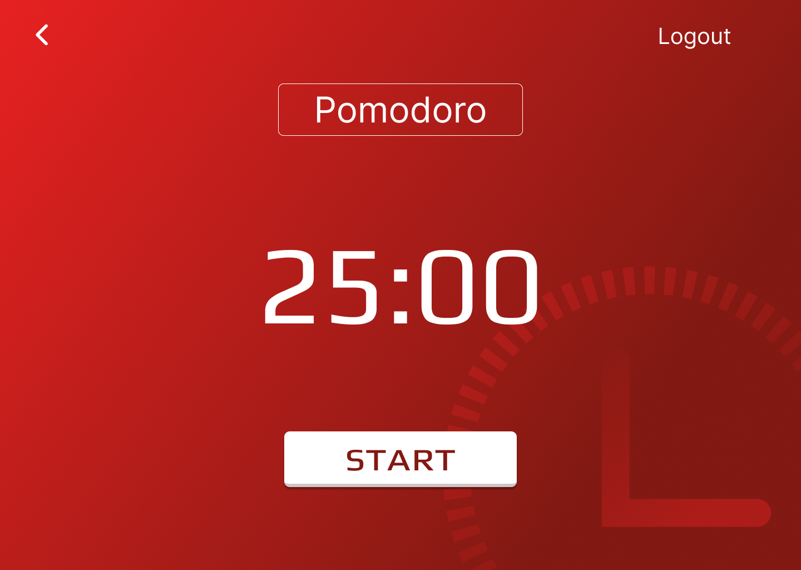
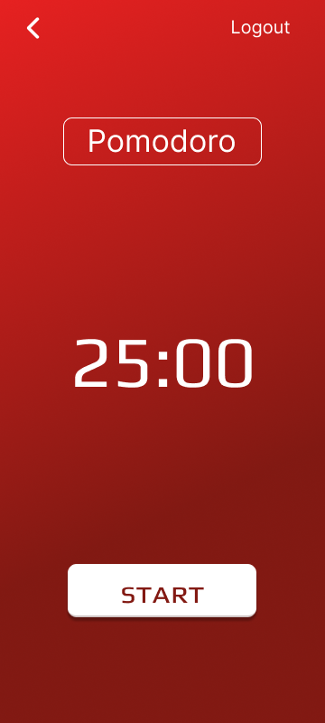
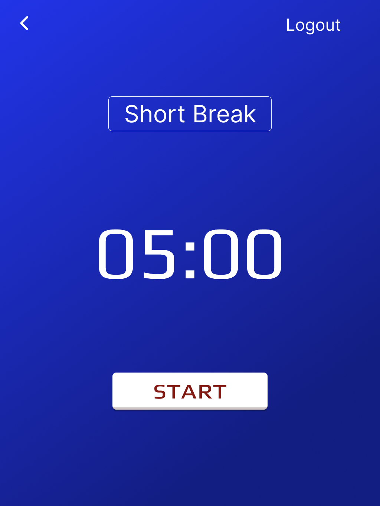

# Pomodoro Timer Clone


I saw this project on **Tiff in Tech** YouTube Channel, so I decide to replicate this project on my own. You can find this project [Code a Pomodoro JavaScript App](https://www.youtube.com/watch?v=8VRNSIc4VeQ&t=188s) on her channel or go to github repository and clone the Freshman's project [Freshman tech - Pomodoro App](https://github.com/Freshman-tech/pomodoro-starter-files.git), but if you want to learn by reading, go to his website [How to build a Pomodoro Timer](https://freshman.tech/pomodoro-timer/) and follow the steps.

First, I used figma to create the scratch and see how it looks like, and the final result you can see on the image above, but the *Pomodoro Timer Clone* has no clock image.

I will update the project in the next few days, adding more content to it, something like the image below, except the logout button.



or like this.



This project has a medium level of difficulty and teach us how to work with the **DOM**, (Document Object Model) in different ways.

¿What is a Pomodoro Timer?

The text below was extracted from [How to build a Pomodoro Timer](https://freshman.tech/pomodoro-timer/) website:

- *Pomodoro is a time management technique developed in the 1980s which uses a timer to break down work into intervals, traditionally 25 minutes in length, separated by short breaks.*

## Piece of code

1. Create an object variable called *timer*.

```js
  const timer = {
    pomodoro: 25,
    shortBreak: 5,
    longBreak: 15,
    longBreakIntervals: 4,
    sessions: 0
  }
```
2. Create a *handleMode()* function.

```js
  const modeButton = document.getElementById('js-mode-buttons');
  modeButtons.addEventListener('click', handleMode);

  function handleMode(event){
    const { mode } = event.target.dataset;
    if( !mode ) return

    switchMode(mode)
  }
```

3. Create and call the *switchMode()* function.

```js
  function switchMode(mode){
    timer.mode = mode;
    timer.remainingTime = {
      total: timer[mode] * 60,
      minutes: timer[mode],
      seconds: 0
    }
  }

  document.querySelectorAll('button[data-mode]')
      .forEach(button => button.classList.remove('active'));
    document.querySelector(`[data-mode="${mode}"]`)
      .classList.add('active');
    document.body.style.color = `var(--${mode === 'pomodoro' ? 'white' : 'dark'})`;
    document.body.style.backgroundImage = `var(--${mode})`;
    document.getElementById('js-progress')
      .setAttribute('max', timer.remainingTime.total);

    updateTimer()
```

4. Update the timer function.

```js
  function updateTimer(){
    const remainingTime = timer;
    const remainingMins = `${remainingTime.minutes}`.padStart(2, '0');
    const remainingSecs = `${remainingTime.seconds}`.padStart(2, '0');
  }

  let minutes = document.getElementById('js-minutes');
  let seconds = document.getElementById('js-seconds');

  minutes.textContent = remainingMins;
  seconds.textContent = remainingSecs;

  const text = (timer.mode === 'pomodoro') ? 'Get back to work!' : 'Take a break!';
  document.title = `${remainingMins}:${remainingSecs} - ${text}`
```

Follow the steps on the Freshman's page [How to build a Pomodoro Timer](https://freshman.tech/pomodoro-timer/) to complete the project or follow to Tiff in Tech [How to build a Pomodoro JavaScript App](https://www.youtube.com/watch?v=8VRNSIc4VeQ&t=188s) on her YouTube Channel.